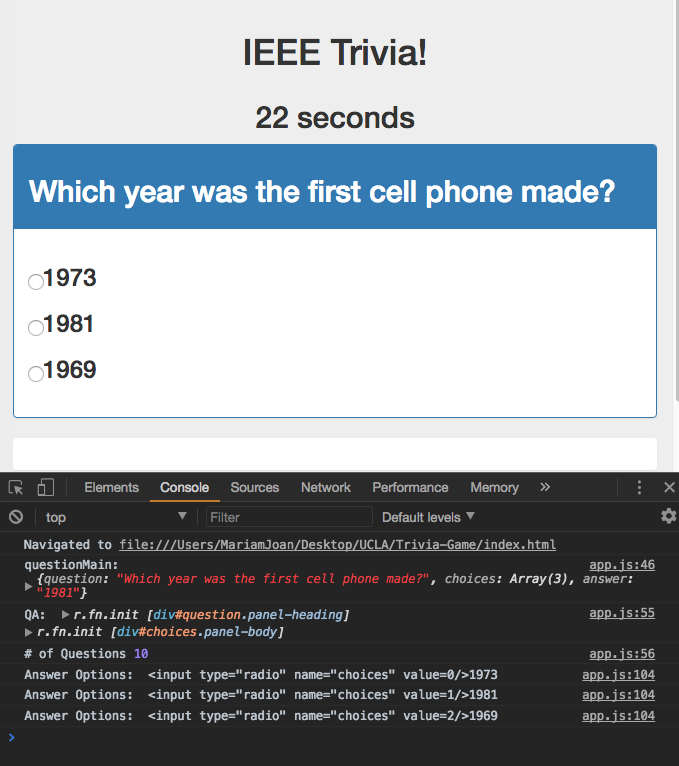
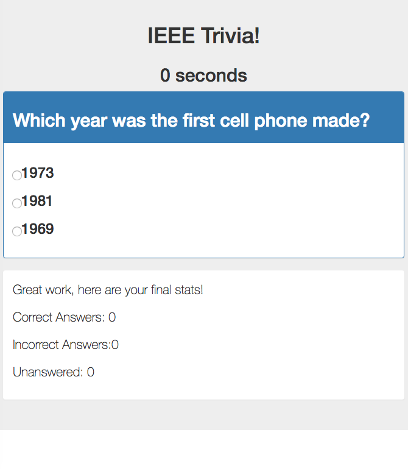

## Trivia-Game

## Overview

Here I created a Trivia game using JavaScript for the logic and jQuery to manipulate HTML, based on Coding Boot Camp (C) 2016 template code. 

### Process

1. Create a GitHub repo called `TriviaGame`, then clone the repo to your computer.
2. Create a file inside of the `TriviaGame` folder called `index.html`. This is where you'll mark up all of your HTML.
3. Don't forget to include a script tag with the jQuery library.
4. Create a folder inside of the `TriviaGame` folder called `assets`.
5. Inside `assets`, create three folders: `css`, `javascript`, `images`
   * In your `css` folder, create a `style.css` file.
   * In your `javascript` folder, create an `app.js` file; here you'll write all of your JavaScript and jQuery.
   * In your `images` folder, save whatever images you'd like to use in this exercise.
6. Choose a game to build from your options below. 

##### Copyright
##### Coding Boot Camp (C) 2016. All Rights Reserved.
